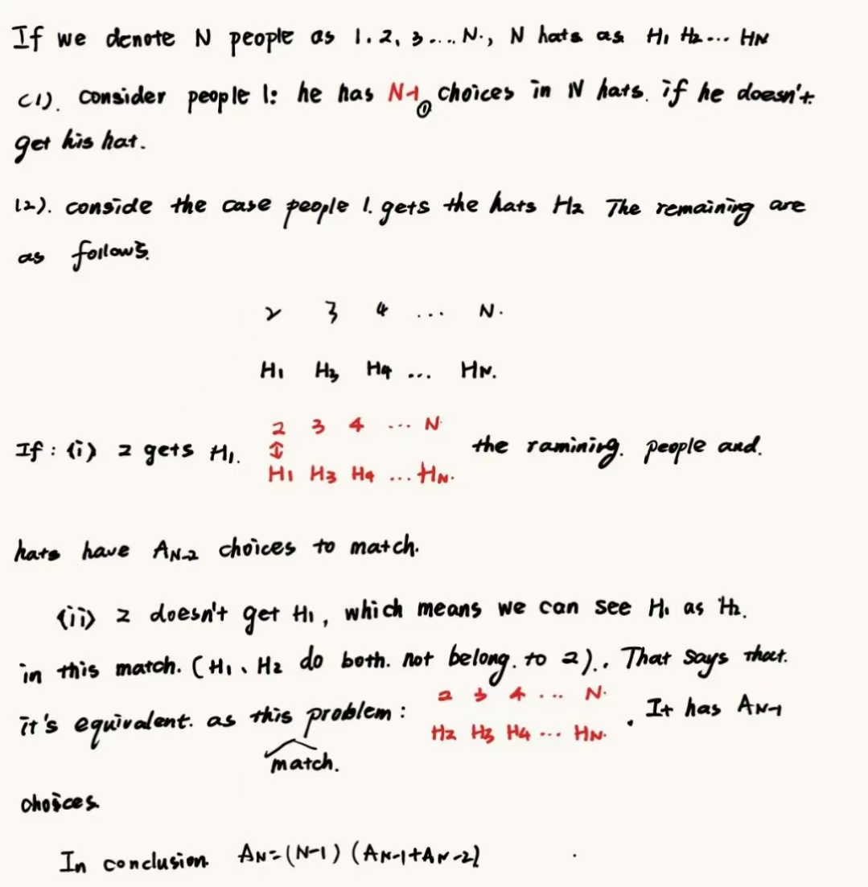

# HW2

## Problem 1

**(a)**

$$
\mathbb{P}(A\cup B)=1-\mathbb{P}(A^c\cup B^c)=0.65
$$

**(b)**

$$
\mathbb{P}(A\cap B^c)=\mathbb{P}(A)\mathbb{P}(B^c)=0.15
$$

**(c)**

$$
\mathbb{P}(A\cup B)=0.15
$$

## Problem 2

Let $|S|=100$.

**(a)** Let $E_1$ be the event that the student chosen is not in any of the language classes, and $|E_1|$ be the number of these student satisfying $E_1$

$$
\mathbb{P}(E_1)=\frac{|E_1|}{|S|}=\frac{34}{100}= 0.34
$$

**(b)** Let $E_2$ be the event that the student chosen is taking exactly one language class, and $|E_2|$ be the number of these student satisfying $E_2$

$$
\mathbb{P}(E_2)=\frac{|E_2|}{|S|}=\frac{66-2-10-2-4}{100}=0.48
$$

**(c)** Let $E_3$ be the event that the two students chosen at least 1 is taking 1 language class.

$$
\mathbb{P}(E_3)=1-\mathbb{P}(E_3^c)=1-0.52^2=0.7296
$$

## Problem 3

The all results of sum are as follows:

|   | 1 | 2 | 3 | 4 | 5  | 6  |
| - | - | - | - | :-: | -- | -- |
| 1 | 2 | 3 | 4 | 5 | 6  | 7  |
| 2 | 3 | 4 | 5 | 6 | 7  | 8  |
| 3 | 4 | 5 | 6 | 7 | 8  | 9  |
| 4 | 5 | 6 | 7 | 8 | 9  | 10 |
| 5 | 6 | 7 | 8 | 9 | 10 | 11 |
| 6 | 7 | 8 | 9 | 10 | 11 | 12 |

Let $E_n$ denote the event that a 5 occurs on $n$th roll and no 5 or 7 occurs on the first $n-1$ rolls

$$
\mathbb{P}(E_n)=\left(\frac{36-4-6}{36}\right)^{n-1}(\frac{4}{36})
$$

considering all cases until $n\to \infty$, the total probability $\displaystyle \sum_{n=1}^{\infty}\mathbb{P}(E_n)$ is the probability that 5 occurs first.

$$
\sum_{n=1}^{\infty}\mathbb{P}(E_n)=\frac{2}{5}
$$

## Problem 4

Suppose that the 4 couples are $A_1,A_2,B_1,B_2,C_1,C_2,D_1,D_2$,where the same two letters with $1,2$ are a couple. Let

* $E_1$ be the event that $A_1,A_2$ are next to each other.
* $E_2$ be the event that $B_1,B_2$ are next to each other.
* $E_3$ be the event that $C_1,C_2$ are next to each other.
* $E_4$ be the event that $D_1,D_2$ are next to each other.

$$
\begin{aligned}
\mathbb{P}(E_1\cup E_2\cup E_3\cup E_4)& =\mathbb{P}(E_1)+\mathbb{P}(E_2)+\mathbb{P}(E_3)+\mathbb{P}(E_4)\\
& -\mathbb{P}(E_1E_2)- \cdots -\mathbb{P}(E_3E_4)\\
& +\mathbb{P}(E_1E_2E_3)+ \cdots +\mathbb{P}(E_2E_3E_4)\\
& -\mathbb{P}(E_1E_2E_3E_4)\\
& =4\mathbb{P}(E_1)-6\mathbb{P}(E_1E_2)+4\mathbb{P}(E_1E_2E_3)-\mathbb{P}(E_1E_2E_3E_4)\\
& =\frac{4\times A_2^1\times A_7^7}{A_8^8}-\frac{6\times (A_2^1)^2\times A_6^6}{A_8^8}+\frac{4\times (A_2^1)^3\times A_5^5}{A_8^8}-\frac{(A_2^1)^4\times A_4^4}{A_8^8}\\
& =\frac{23}{35}
\end{aligned}
$$

$E_1^c\cap E_2^c\cap E_3^c\cap E_4^c$ is the event that no couples are next to each other.

$$
\mathbb{P}(E_1^c\cap E_2^c\cap E_3^c\cap E_4^c)=1-\mathbb{P}(E_1\cup E_2\cup E_3\cup E_4)=1-\frac{23}{35}=\frac{12}{35}
$$

## Problem 5 (*Bonferroni's inequality*)

We prove the inequality directly

$$
LHS=\mathbb{P}(EF)=1-\mathbb{P}(E^c\cup F^c)=1+\mathbb{P}(E^cF^c)-\mathbb{P}(E^c)-\mathbb{P}(F^c)\ge 1-[1-\mathbb{P}(E)]-[1-\mathbb{P}(F)]=\mathbb{P}(E)+\mathbb{P}(F)-1=RHS
$$

## Problem 6 (The matching problem)

## Problem 7

Let $E$ be the event that at least one lands on 6, and $F$ be the evnet that the dice land on different numbers.

$$
|F|=36-6=30
$$

$$
|E\cap F|=2\times 5=10
$$

$$
\mathbb{P}(E|F)=\frac{|E\cap F|}{F}=\frac{10}{30}=\frac{1}{3}
$$

## Problem 8

Let $E$ be the event that the ball chosen from $A$ is white. and $F$ be the event that 2 white balls exactly are selected

$$
|F|=4\times 4\times 1+4\times 8\times 3+2\times 4\times 3=136
$$

$$
|E\cap F|=2\times 4\times 3=24
$$

$$
\mathbb{P}(E|F)=\frac{24}{136}=\frac{3}{17}
$$

## Problem 9

$$
|A_s|=51
$$

$$
|A|=\binom{52}{2}-\binom{48}{2}=198
$$

$$
|B\cap A_s|=3
$$

$$
|B\cap A|=\binom{4}{2}
$$

**(a)** $\displaystyle \mathbb{P}(B|A_s)=\frac{|B\cap A_s|}{A_s}=\frac{3}{51}=\frac{1}{17}$

**(b)** $\displaystyle \mathbb{P}(B|A)=\frac{6}{198}=\frac{1}{33}$

## Problem 10

**(a)** Let $E$ denote the event that the first 2 balls are black and the next two are white.

$$
\mathbb{P}(E)=\frac{7\times 9\times 5\times 7}{12\times 14\times 16\times 18}=\frac{35}{768}
$$

**(b)** Let $F$ debote the event that there are exactly 2 black balls. Note that the probability is the same no matter where we get the two black balls.

$$
\mathbb{P}(f)=\binom{4}{2} \mathbb{P}(E)=\frac{35}{128}
$$
